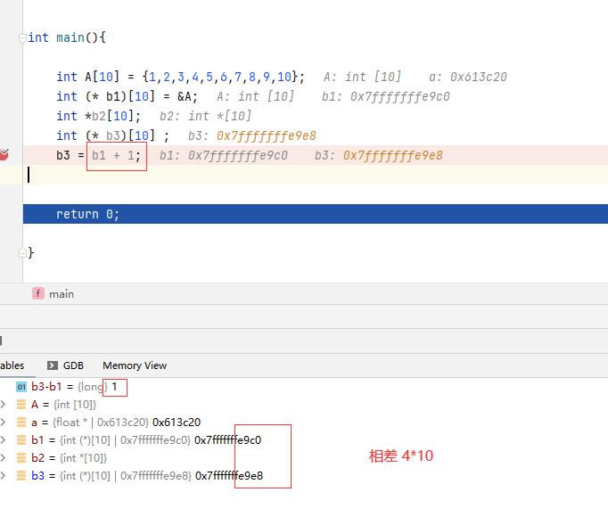

# C++ 必知必会

## 函数参数
1. 数组形参，在函数定义时限制数组的长度

    将数组形参定义为引用，这样在编译器期会检测传入的数组是不是长度为 10 了。

    ```c++
    void setArray2(float (& a)[10]){
        // pass
    }
    
    ```

2. 数组指针和指针数组

    两者在定义方式上的区别如下。
   
    数组指针指向一个数组，在执行 ++p 操作时，p 指针会向高地址位前进一个数组的长度（本例中为 10）。

    指针数组中的每一个元素都是一个指针，指向一块地址，这块地址可能是一个 int，也可能是一个 int 数组。

    ```c++
    int *p[10]; // 指针数组
    int (*p)[10]; // 数组指针
    ```

    


## 指针与强制类型转换
1. static_cast dynamic_cast 


2. 常量指针和指向常量的指针

    ```c++
    int a = 10,b=20;
    int *const p1 = &a; // 一个 const 指针
    *p1=11; // 被允许
    p1=&b; // 不被允许！
    int const * p2 = &a; // 指向常量的指针
    p2=&b; // 被允许
    *p2=22; // 不被允许！
    ```

## 类与对象
1. 有些类的方法会在定义完参数之后写一个 const，以表示这个方法不会更改类的成员变量。

    ```c++
    class X{
        int a;
        int getA() const{
            return a; // 不会更改 a 的值
        }
    };
    ```


